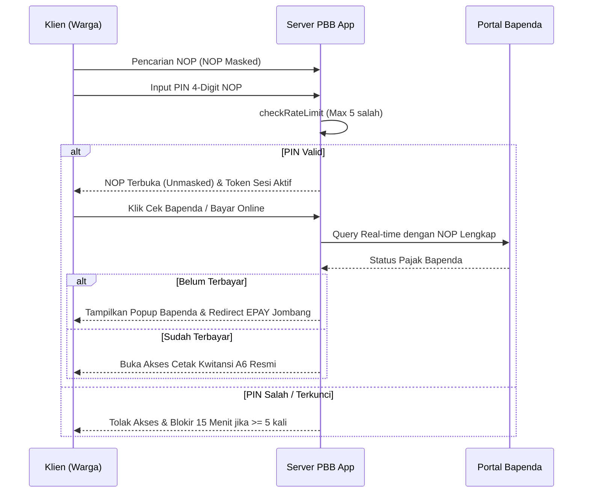

# Wiki Sistem PBB Manager v10.0

Selamat datang di Wiki Teknis untuk proyek **PBB Manager**. Dokumen ini berfungsi sebagai pusat informasi mengenai arsitektur, keamanan, GIS, dan pemeliharaan sistem terintegrasi (Web & Mobile).

---

## Arsitektur & Teknologi (v10.0)

Sistem ini dibangun dengan stack modern yang dioptimalkan untuk performa tinggi, kestabilan luar biasa pada server dengan sumber daya terbatas (seperti VPS ARM64/Armbian), serta operasional lapangan berbasis mobile yang tangguh.

### Core Backend & Web
*   **Framework**: Next.js 16 (App Router) & React 19 (React Compiler Enabled).
*   **Keamanan Core**: Next-Auth v4 dengan enkripsi data tangguh, proteksi Cross-Site Scripting (XSS) via `dompurify`, dan header anti-scraping `X-Robots-Tag`.
*   **ORM / Database**: Prisma 7.8 & SQLite (WAL Mode enabled dengan `PRAGMA synchronous = NORMAL` & `busy_timeout = 5000` untuk performa baca-tulis konkuren super cepat tanpa kendala locked database).

### PBB Mobile Excellence (v1.2.0)
*   **Platform**: React Native (Expo SDK 55 & React Native 0.85).
*   **Styling**: NativeWind (Tailwind CSS for Native).
*   **Bridging**: Mekanisme `magicToken` untuk otentikasi aman antara aplikasi native dengan fitur berbasis WebView.
*   **Building**: Terintegrasi dengan **EAS Build** (Expo Application Services) untuk otomasi pembuatan file APK/AAB secara terpusat.

---

## Hardening & Keamanan Skala Tinggi (Update v10.0)

Kami secara aktif melakukan audit keamanan menyeluruh dan menerapkan pengamanan berlapis guna menjaga integritas data desa serta kerahasiaan informasi wajib pajak warga.

### 1. Sistem Proteksi NOP PIN 4-Digit (SEC-04 & SEC-05)
*   **Masking NOP Publik**: Semua NOP di halaman hasil pencarian portal publik dan peta GIS publik disensor menjadi `35.17.XXX.XXX-XXXX.X` secara *out-of-the-box* demi mencegah pemindaian data massal (*mass data scraping*). Nama dan Alamat dibiarkan penuh agar warga tetap mudah memvalidasi kewajiban tagihan mereka.
*   **Verifikasi PIN NOP Fisik**: Warga diwajibkan memasukkan 4 digit nomor urut atau 4 digit absolut terakhir NOP dari lembar fisik SPPT mereka untuk membuka kunci sensor (*unmask NOP*), menyalin NOP asli, mencetak bukti lunas/kwitansi A6, mengunduh file asli E-SPPT PDF, dan mengakses formulir pengajuan baru LSPOP/Mutasi PBB.
*   **Rate-Limiting & IP Lockout**: Pengujian PIN dilindungi oleh filter *Server-Side Rate Limiter* terenkripsi (`checkRateLimit`) dengan fallback SQLite/in-memory. Batas percobaan salah adalah **maksimal 5 kali salah PIN per 15 menit**. Jika dilampaui, alamat IP klien akan diblokir total secara otomatis selama 15 menit.

### 2. Pengamanan API & Sistem File (SEC-01 & SEC-02)
*   **Broken Authentication pada Mobile API (SEC-01)**: Seluruh method operasional `GET` dan `POST` di endpoint API petugas mobile wajib memvalidasi token JWT via middleware `requireMobileAuth`, mencegah akses liar dan manipulasi status `LUNAS` secara ilegal.
*   **Zip Slip / Path Traversal Protection (SEC-02)**: Modul pemulihan database restore (`restore.ts`) menggunakan fungsi pengaman `resolveSafeChildPath` untuk menjamin seluruh file ZIP cadangan diekstrak hanya ke dalam subdirektori tujuan yang aman, menghindari bahaya penimpaan file sistem sensitif (*webshell write*).
*   **Security Header & Anti-Indexing**: Perlindungan Triple-Shield terhadap perayap bot/search engine dengan header `X-Robots-Tag: noindex, nofollow`, meta tag robots, dan `robots.txt` ketat.

### 3. Integrasi Cloudflare Turnstile & Lifecycle SPA
*   **Explicit Dynamic Rendering**: Turnstile dipasang dengan mode rendering eksplisit (`?render=explicit`) di sisi klien. Widget diinisialisasi secara programmatik pada React `ref` kontainer, menjamin Turnstile selalu muncul kembali secara instan dan siap divalidasi ketika warga berpindah-pindah tab antara Peta GIS dan Cek Status tanpa perlu menyegarkan peramban (*SPA-safe lifecycle*).

---

## Indeks Dokumentasi Lengkap

Gunakan panduan berikut untuk kebutuhan operasional Anda:

| Dokumen | Deskripsi |
| :--- | :--- |
| **[Panduan Instalasi](./PANDUAN_INSTALASI.md)** | Instruksi penyiapan server, konfigurasi database, dan inisialisasi awal. |
| **[Dokumentasi Penggunaan](./DOKUMENTASI_PENGGUNAAN.md)** | Panduan dashboard admin, operasional petugas mobile, dan pengaturan desa. |
| **[Panduan Arsip Digital](./PANDUAN_ARSIP_DIGITAL.md)** | Detail teknis mengenai *Smart Scan* pemecah PDF massal dan indeks arsip terenkripsi. |
| **[Checklist Produksi](./CHECKLIST_PRODUCTION.md)** | Panduan hardening environment, backup terjadwal, trust proxy, dan persiapan go-live. |
| **[README Utama](../README.md)** | Gambaran umum proyek, arsitektur, dan fitur unggulan. |

---

## Alur Kerja Teknis (Workflows)

### 1. Alur Pembayaran Bapenda Online & Cek Status

### 2. GIS Pipeline Publik vs Admin
1. **Admin /peta Dashboard**:
   - Melewati verifikasi sesi admin server-side.
   - Peta menampilkan NOP secara transparan penuh tanpa sensor.
   - Admin dapat menyalin data langsung dan memodifikasi layer wilayah tanpa prompt PIN.
2. **Publik GIS Map**:
   - Tidak ada otentikasi admin.
   - Detail Wajib Pajak pada popup peta menampilkan NOP yang tersensor.
   - Aksi Bayar Online dan Cek Bapenda diwajibkan melewati popup input PIN NOP 4-digit.

---

## Kontak & Pemeliharaan
Pastikan untuk menjalankan `git pull` secara berkala untuk menerima patch keamanan terbaru. Untuk aplikasi mobile, lakukan regenerasi berkas build APK menggunakan EAS CLI jika ada perubahan schema API backend.

*Terakhir diperbarui: 23 Mei 2026*
